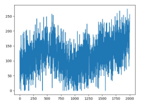

# Reinforcement-Learning-Project - Space Invader

## Project Goal
To examine the effect of different game representations on different models

## Space  Invader Representation
 - Each state represent by the screenshot with some preprocess
 - Each state represent ram representation - each state composed from 128 bytes that describe the game, this yield vector (1,128)

## Models:
 - Deep Q-learning - Main & Target
 - REINFORCE(MC)
 - Actor Critic

## Results
 - Ram representation is much quicker compared to pixels state since each state (1,128) specially when we add exploration in the test time 
 - The model converge after some hundreds of episode

   
   
   
To Read more on the project press [here](https://docs.google.com/presentation/d/10AqDZIxma_S2JroKJRLLqhP9dijU-_V-Q8RoQvU_Eus/edit#slide=id.g12ef171e761_0_5)! 
